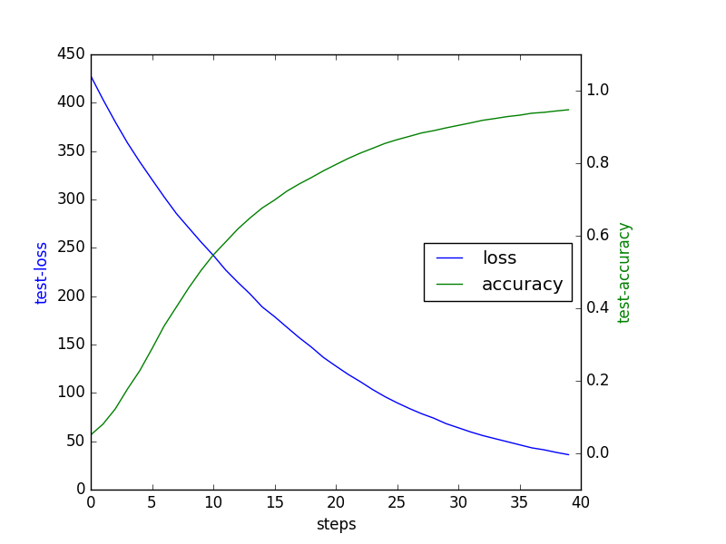
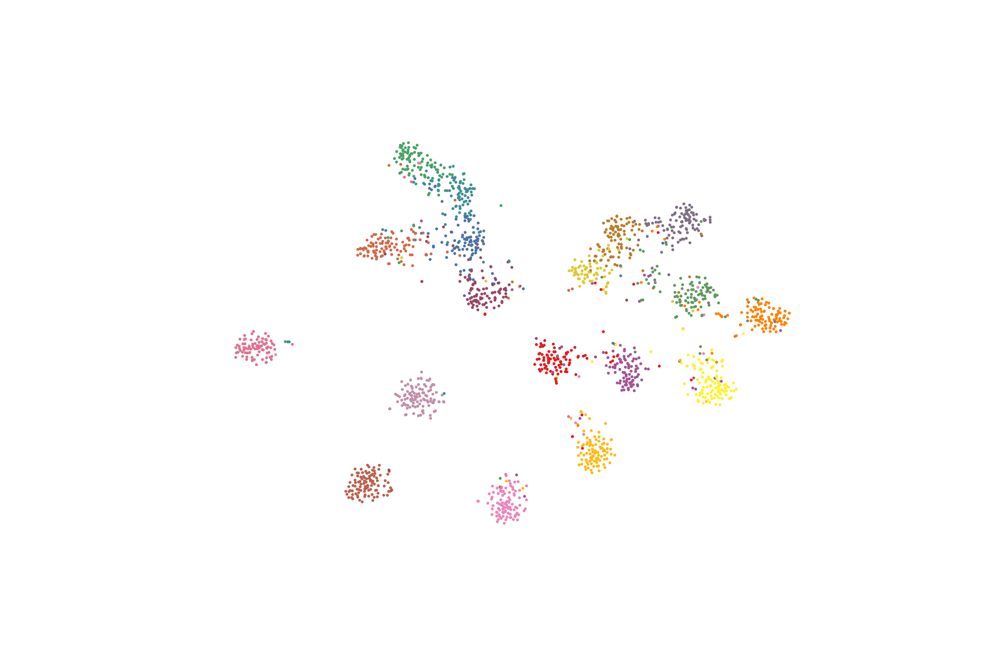

# 手势识别代码使用说明

### 环境说明
本代码在Linux服务器下运行无误，因为本人没有windows环境所以还未在Windows环境上测试。如在Windows环境上测试有问题，不能解决的及时联系。Linux环境上运行的主要配置如下：

- python 3.5
- pytorch 1.3
- torchvision 0.4.1
- Pillow 6.0.0
- tqdm 
- matplotlib 
- numpy 1.16.2 
- scikit-learn 0.20.0 

可尝试在Windows下运行，若报错缺少某个模块，再对应安装。

### 数据说明
训练数据可以采用提供的3次数据集进行训练，其中对应的dataset文件分别为`./datasets/asl_dataset.py`,`./datasets/datatang_dataset.py`和`./datasets/sign_dataset.py`中。若要更改对应的数据集，需要将`train.py`中import对应的数据集类，并且在`train.py`90行中修改对应的数据集路径，分别为`./dataset5`, `./dataset_0305`和`./original_images/original_images`。
<!-- 数据采用asl数据集(https://www.kaggle.com/mrgeislinger/asl-rgb-depth-fingerspelling-spelling-it-out/code?datasetId=122788&sortBy=voteCount)。采用其中的RGB图片进行训练，训练集和测试集合按9:1的比例划分。具体方式定义在`./datasets/asl_dataset.py`中，可自行修改。数据下载解压好在主目录`./dataset5`中。 -->


### 网络结构说明
网络采用了ResNet18作为分类网络，并且可以对分类网络进行替换，替换为ResNet50、DenseNet、VGG等不同的分类网络进行测试。可在`config.py`中进行指定。

### 运行说明
具体设置保存在`config.py`中，训练保存的模型文件保存在`./checkpoints`对应的实验名称中，还会生成对应的数据信息`data_info.json`、训练信息`train_info.json`和损失函数图像如下。




具体训练方法
```
# training 
CUDA_VISIBLE_DEVICES=0 python train.py

# testing 
CUDA_VISIBLE_DEVICES=0 python test.py -r ./checkpoints/xxxxxx(训练模型路径) -v
```

测试中`-v`会生成对应的聚类可视化结果，保存在`./plots`中。并且输出测试集准确率、互信息和兰德系数，并计算互信息和兰德系数的调和平均。



### 聚类可视化
可以对生成的不同epoch的model进行测试，并且输出对应的指标和聚类可视化结果。运行`./test.sh`可以循环保存不同epoch的模型生成的聚类可视化结果。对于不同的模型，可以在`./test.sh`中修改`-r`后的模型保存路径即可。
```
./test.sh
```


