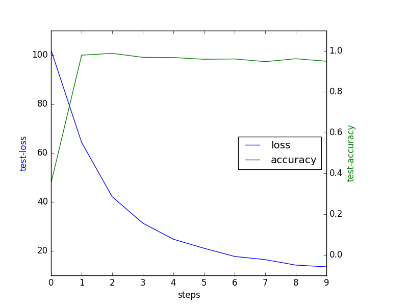
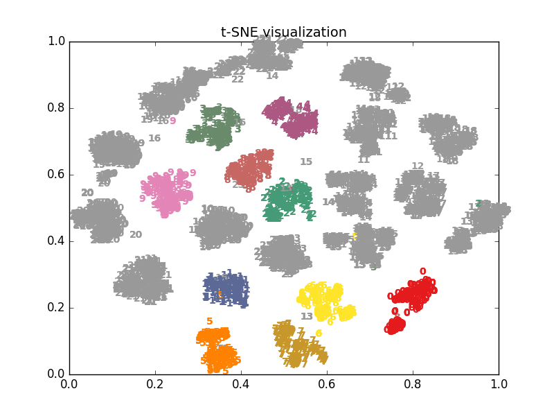

# 手势识别代码使用说明

### 环境说明
本代码在Linux服务器下运行无误，因为本人没有windows环境所以还未在Windows环境上测试。如在Windows环境上测试有问题，不能解决的及时联系。Linux环境上运行的主要配置如下：

- python 3.5
- pytorch 1.3
- torchvision 0.4.1
- Pillow 6.0.0
- tqdm 
- matplotlib 
- numpy 1.16.2 
- scikit-learn 0.20.0 

可尝试在Windows下运行，若报错缺少某个模块，再对应安装。

### 数据说明

数据采用https://www.kaggle.com/gti-upm/leapgestrecog 中的手势数据集，其中数据集均为灰度图片，总共20000张，并未划分训练集和测试集合。为此，我们在后续尝试了不同的划分方式:按人划分和随机划分。 默认采用按人划分，具体方式定义在`./datasets/hand_dataset.py`中，可自行修改。数据下载好放在`./data`中。

```
# move the dataset to the dictionary
cp -r /path/to/dataset ./ 

# Rename to data
mv leapGestRecog data
```

### 网络结构说明
网络采用了ResNet18作为分类网络，并且可以对分类网络进行替换，替换为ResNet50、DenseNet、VGG等不同的分类网络进行测试。可在`config.py`中进行指定。

### 运行说明
具体设置保存在`config.py`中，训练保存的模型文件保存在`./checkpoints`对应的实验名称中，还会生成对应的数据信息`data_info.json`、训练信息`train_info.json`和损失函数图像如下。




具体训练方法
```
# training 
CUDA_VISIBLE_DEVICES=0 python train.py

# testing 
CUDA_VISIBLE_DEVICES=0 python test.py -r ./checkpoints/0218_lr1e-6_resnet18_norandom/ep-9.pth -v
```

测试中`-v`会生成对应的聚类可视化结果，保存在`./plots`中。并且输出测试集准确率、互信息和兰德系数，并计算互信息和兰德系数的调和平均。




